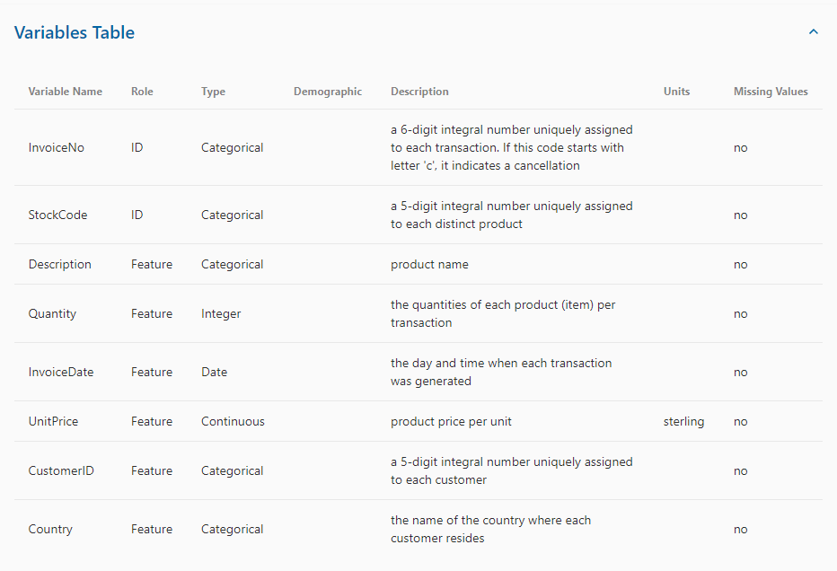
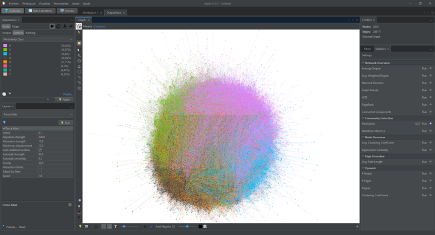
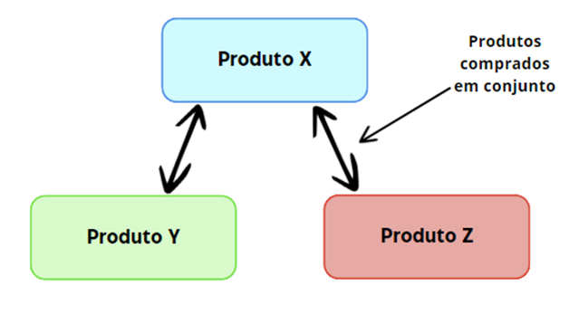

# TFC - DEISI 64 - Recommender Systems

- This repo will be in the institutional account later.
- URL Dataset Online Retail: https://archive.ics.uci.edu/dataset/352/online+retail
- Deisi64 (Analysis of joint purchasing patterns for recommendation systems in an online gift store), Copyright of Henrique Aleixo e João Serralha, Universidade Lusófona.

___
## **Introduction**

The recommendation of products plays a vital role in the landscape of e-commerce. 
As online stores continue to grow, this aspect becomes one of the main drivers of success and competitiveness in the market. Therefore, enhancing the
accuracy of recommendations has become a fundamental goal.
With a view towards application in recommendation systems, in this Final
Coursework (TFC), we explore a dataset containing over 500,000 records of purchases
from a gift store. The intention is to use this data to create a network structure that
allows us to explore various network analysis methodologies. We aim to relate
products, purchases, and customers, extracting information from these relationships
to make more effective recommendations.

## **Installation guide**

To run the simulation, you need to pull the repository.
Then, install [Python environment](https://www.python.org/downloads/) and you will have two options:

Either open the file **Queries.ipynb** with [VSCode](https://code.visualstudio.com/download)

***OR***

Install [Jupyter Notebook](https://jupyter.org/install) to open the file locally.

## **Libraries**

Before running the queries, it is required to install these packages in the VSCode terminal

Package | Installation
 :---: | ---
`pip` | python get-pip.py
`openpyxl` | pip install openpyxl
`numpy` | pip install numpy
`networkx` | pip install networkx
`matplotlib` | pip install matplotlib
`pandas` | pip install pandas
`seaborn` | pip install seaborn
`scipy` | pip install scipy

***All done.*** Now, you can run the queries and make sure you have all the files locally.

## **Gephi**

To be able to create a network structure, it is required to use a open source platform called Gephi[^BaHe09]. This software has many important functions, but what we want
is to transform our input to something we can see graphically. It uses social network analysis algorithms for our purpose.

[^BaHe09]: Bastian M., Heymann S., Jacomy M. (2009). Gephi: an open source software for
exploring and manipulating networks. International AAAI Conference on Weblogs
and Social Media.

## **Network creation process**

First, we need to check the data we have and take out information that we will not need, to be easier to make this process.
In this specific DataSet, we encountered cells that had products reimbursed, expenses from the store and some cells without
Client ID's, being this data to be filtered from the original DataSet.

### 1. **Product-Product Network**

The idea in this network, is that products frequently purchased together have some degree of similarity from the outset, therefore
if a user is buying product X, product Y and Z will be recommended if these are normally purchased together with X.

